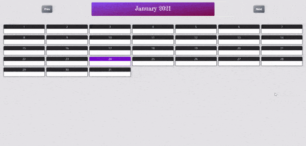

import NoTargets from "../../_partials/no-targets.md";
import NoClasses from "../../_partials/no-classes.md";
import NoEvents from "../../_partials/no-events.md";
import NoSideEffects from "../../_partials/no-side-effects.md";

## Purpose

Remotely set the `src` of TurboFrames, and/or remotely clear their content.

### Use Case 1: Modal form.

### Use Case 2: Links to drive turbo-frame wrapped widgets
If you have an interactive widget/component wrapped in a turbo frame, you can use this links to swap
out the frame widget, or selectively load/unload it.

## [Actions](https://stimulus.hotwire.dev/reference/actions)

| Action   | Purpose                                                                                                      |
|----------|--------------------------------------------------------------------------------------------------------------|
| `setSrc` | Sets the src of the remote `<TurboFrame>` to the specified value, triggering a content load                  |
| `clear`  | Clear the `src` of the remote `<TurboFrame>`, and remove its `innerHTML`                                     |
| `toggle` | If the `src` is empty, or different to the current specified value, calls `setSrc`. Otherwise, calls `clear` |

## [Targets](https://stimulus.hotwire.dev/reference/targets)
<NoTargets/>

## [Classes](https://stimulus.hotwire.dev/reference/classes)
<NoClasses/>

## [Values](https://stimulus.hotwire.dev/reference/values)

| Value                       | Type   | Description                                     | Default                                                                                            |
|-----------------------------|--------|-------------------------------------------------|----------------------------------------------------------------------------------------------------|
| `frameId`                   | String | The ID of the frame to drive                    | -                                                                                                  |
| `src` (Optional)            | String | The URL set the remote frame's `src` to         | If the controller root element is an `<a>`, the `href` of the element. Otherwise, throws an error. |
| `loadingMessage` (Optional) | String | The message to display while content is loading | -                                                                                                  |

## Events
<NoEvents/>

## Side Effects
<NoSideEffects/>

## How to Use

## HTML
Example WIP

